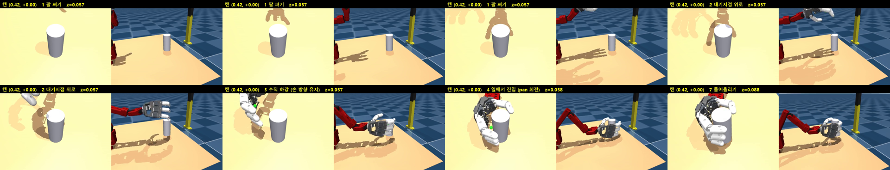

# SO-Arm101 + AmazingHand

SO-101 로봇팔에 [AmazingHand](https://github.com/pollen-robotics/AmazingHand)(오른손)를 결합해 캔을 잡는
MuJoCo 파지 시뮬레이션과 관련 CAD 파일 모음.
목표는 실물 teleop 데이터와 섞어 ACT를 학습할 **시뮬레이션 데모 데이터**를 자동 생성하는 것(A안).

<p align="center"></p>

- 데모 영상: [`media/hand_side_grasp_thumbup.mp4`](media/hand_side_grasp_thumbup.mp4)

## 폴더 구성

| 경로 | 내용 |
|---|---|
| `sim/` | MuJoCo 모델(MJCF), Gymnasium 환경, 스크립트 파지 전문가, 데이터 수집 코드. 자세한 설명은 [`sim/README.md`](sim/README.md) |
| `project_cad_file/` | SolidWorks 원본 및 STEP 파일 (손, 팔, 인터페이스, 카메라 스탠드) |
| `real/` | 실물 SO-101 + 외부 카메라로 정책을 돌리는 단계별 스크립트(step1~5). 아래 "실물 실행" 참고 |
| `handeye_calib_Ateam/` | 핸드아이 캘리브(픽셀→관절각 2차 다항식)와 실물 기준값 `hardware_spec.json`. [README](handeye_calib_Ateam/README.md) |
| `media/` | 파지 데모 영상과 프레임 |
| `so_arm101.urdf`, `model.xml` | 팔 URDF / MJCF |
| `*.STL`, `*.step`, `*.SLDASM` | 카메라 마운트, 손목 인터페이스, 오른손 CAD |

> 팀원용 단계별 가이드(Claude에게 할 말 포함): [GUIDE.md](GUIDE.md)

## 설치

Python 3.11 이상 권장 (개발은 Windows / Python 3.14).

```bash
python -m venv .venv
.venv/Scripts/pip install -r sim/requirements-sim.txt    # Linux/Mac: .venv/bin/pip
```

## 실행

저장소 루트에서 실행합니다. 아래 `python`은 위에서 만든 `.venv`의 것입니다.

```bash
python -m sim.scripts.view --model handarm --sim        # 결합 모델 뷰어
python -m sim.scripts.scripted_grasp --robot hand --episodes 20   # 스크립트 파지 성공률 측정
python -m sim.scripts.record_dataset --robot hand --name sim_grasp_v0 --episodes 100   # 데이터 수집 → data/
python -m sim.robots.build_combined                     # 결합 모델 재생성 (MOUNT_* 값 수정 후)
```

MJCF의 메시 경로는 상대 경로라 어느 위치에 clone해도 바로 로드됩니다.

## 현재 상태 (2026-10-01)

- 파지: 손바닥을 캔 옆면에 대는 **옆면 파지**(psi=90°), 스크립트 전문가로 데이터 생성.
- 씬은 실제 카메라·책상·캔(133mm, 12g) 기준. 실물 카메라는 팀 핸드아이 캘리브 점으로 맞춘 값(`real/camera_fit.json`).
- 학습 파이프라인: `record_dataset` → `to_lerobot` → `train`(ACT) → `eval_policy`.
- 시뮬 단독 ACT 성능(90지점 격자 평가):

| 버전 | 성공률 |
|---|---|
| v0 | 73% |
| v1 | 64% |
| v2 | 77% |
| **v3** (실제 캔 + 느린 접근 데모) | **89/90 = 98.9%** (랜덤 20/20) |

  비교 그림: `media/eval90_v0_v3.png`, 영상: `media/eval_act_sim_v*.mp4`.
- 주의: 실물 카메라가 보는 범위는 정면 약 ±10–15°라서, v0–v3의 캔 배치 호(±18–41°)는 실물 시야 밖입니다.
  v3를 실물에 그대로 돌리는 것은 아직 의미가 없고, 시야에 맞춘 재학습이 필요합니다.
- 다음 단계: 시야에 맞춘 데이터 재수집·재학습, 팀원 teleop 코드 연동, 실물 데이터와 섞은 비율 비교(A안).

### 실물 실행 (`real/`, `.venv-train`에서)
모터에 캘리브레이션을 쓰지 않고, 모든 명령을 실측 한계와 스텝당 이동량으로 제한합니다. 앞 단계부터 순서대로 하세요.

| 단계 | 스크립트 | 내용 |
|---|---|---|
| 1 | `step1_camera.py` | 카메라만 확인 (로봇 연결 X) |
| 2 | `step2_read_joints.py` | 모터 연결·관절값 읽기 (읽기만) |
| 3 | `step3_dry_run.py` | 정책 드라이런 (모터에 아무것도 안 보냄) |
| 4 | `step4_go_start.py --go` | 시작 자세로 천천히 이동 |
| 5 | `step5_run_policy.py --go` | 정책으로 팔 4관절 제어 (`--go` 없으면 안 움직임) |

### 학습 환경 (선택)
학습/평가는 시뮬 `.venv`와 별도로 `.venv-train`에서 실행합니다.
```bash
python -m venv .venv-train
.venv-train/Scripts/pip install -r sim/requirements-train.txt   # torch(CUDA)는 먼저 설치
.venv-train/Scripts/python.exe -m sim.scripts.to_lerobot --name sim_hand_v0
```
`data/`, `outputs/`(체크포인트, 수 GB)는 저장소에 포함하지 않습니다. 각 스크립트 docstring 참고.

## 크레딧

- SO-101: [TheRobotStudio/SO-ARM100](https://github.com/TheRobotStudio/SO-ARM100)
- AmazingHand MJCF: [pollen-robotics/AmazingHand](https://github.com/pollen-robotics/AmazingHand)
